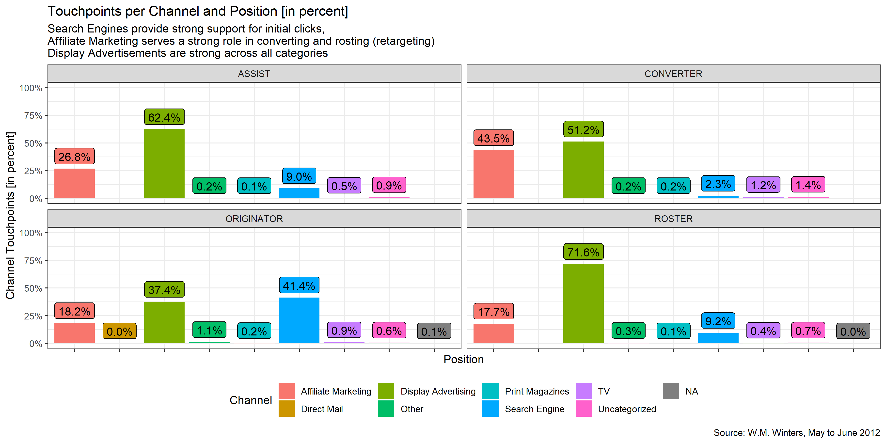

Goals
-------------------

1. Analyse current touchpoints and channels
2. Define effective channels for future strategy
3. Use standard attribution models to allocate revenue
4. Design a specific attribution model
5. Recommend channel weights for multi-channel budget allocation

What makes this project interesting
-------------------

* Completely done in R 
* Easily adjustable because of dplyr + ggplot2 set-up
* My suggested attribution model corrects for biases in other attribution model
* Defined a weight optimization function that helps to define the optimal weight
* This optimization helps a marketer to understand the changing importance for first- and last-clicks

Samples from the Analysis 
-------------------
Touchpoints per Channel and Position Class

